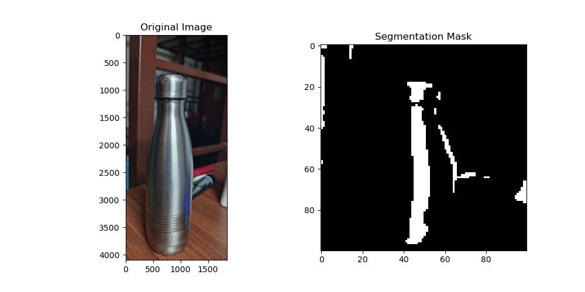

Two files are created for simplification.
First file(train_model.py) contains code of all the implementaions , training of model, importing dataset.
Second file(explore_model.py) conatins code of runinng the trained  model , pre-processing images of gicen dataset, classifiying new images as plastic / glass which is the main purpose. 
Dataset is provided which contains 204 images of glass objects and 200 images of plastic making a toal of 404 images(raw images)
All the images are pre-processed by Python Imaging Library(PIL) and the pre-processed are stored in the folder.
Now, the dataset is split into 80:20 , First 5 images are printed for debugging purposes.
Once the dataset is ready , it is trained using a machine learning model.
A CNN model , U-NET has been used to train the model.
After training the model, its accuracy , f1 score is caluclated (using true tables). 
The trained model is saved in a standard hd5 file . 
New we provide an input of a picture we want to classify 
'Matplotlib' is used to visualize the result.
In the result, we can notice te given input on left , predicted output on right.
The masked image contains white shade which indicated the plastic area of the image whereas black indicated non-plastic area.
The accuracy of the model has been around 83%

