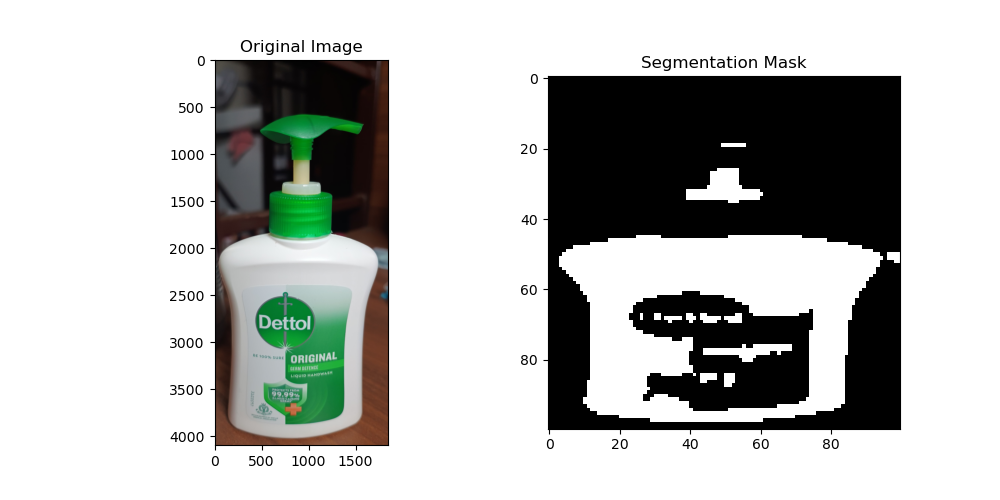

**Plastic and Glass Image Classification**
This project aims to classify images of plastic and glass objects using a Convolutional Neural Network (CNN) model. The implementation consists of two main files: train_model.py and explore_model.py.

**Files Description**
train_model.py: This file contains the implementation of model training, dataset import, and all necessary preprocessing steps. The dataset provided consists of 204 images of glass objects and 200 images of plastic, totaling 404 raw images. All images undergo preprocessing using the Python Imaging Library (PIL), and the processed images are stored in a designated folder.

explore_model.py: This file contains the code for running the trained model. It handles preprocessing of new input images and performs classification. The main purpose of this file is to classify new images as either plastic or glass.

**Dataset Preparation**
The provided dataset is split into an 80:20 ratio for training and validation purposes. The initial five images are printed for debugging and verification purposes.

**Model Training**
The model is trained using a U-Net CNN architecture. After training, the model's accuracy and F1 score are calculated using true tables. The trained model is saved in a standard HDF5 file format for future use.

**Result Visualization**
The result of the model classification is visualized using Matplotlib. The output includes the input image on the left and the predicted output on the right. The masked image highlights plastic areas with white shading, while non-plastic areas are indicated in black.

**Model Performance**
The accuracy of the trained model is approximately 83%.

